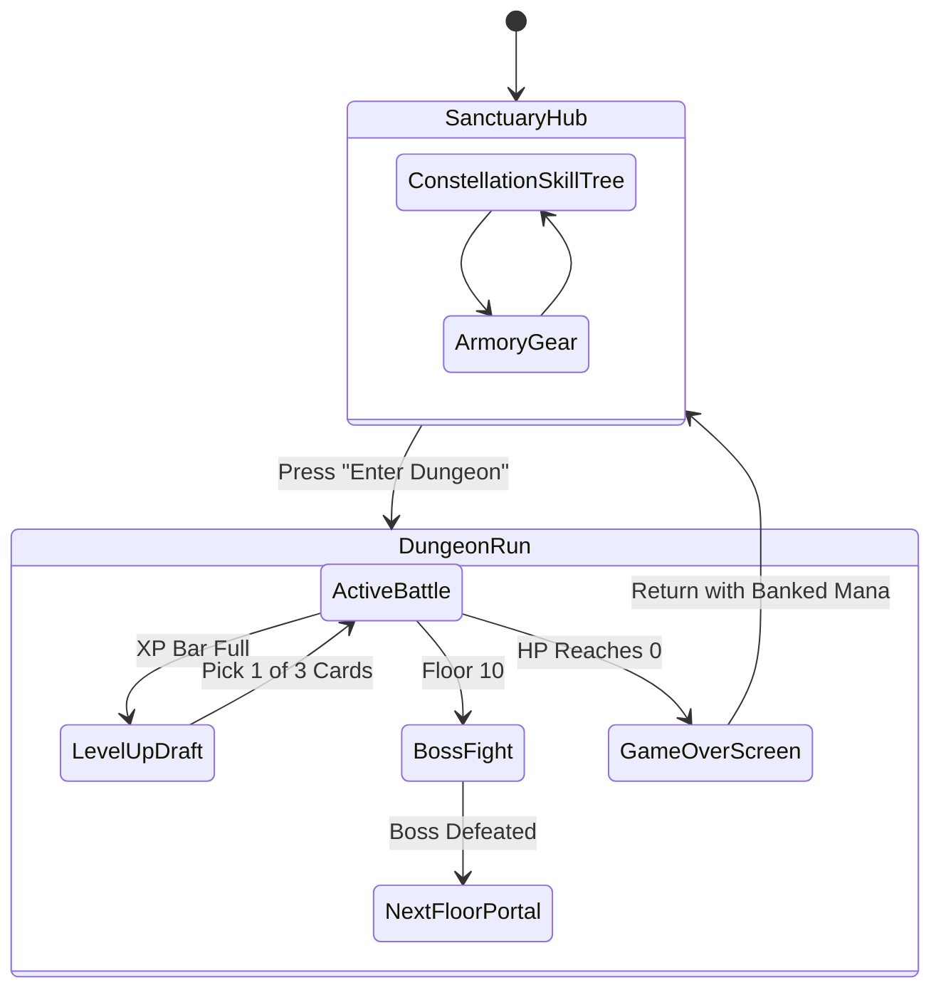

# Implementation Plan: Constellation Map Skill Tree, Real Pixel Assets & Full UI Flow Redesign

Transform **Wizardz** to fix the gameplay flow, implement a **true Constellation Map Skill Tree** (like *Path of Exile* / *Skyrim* / *The Fire Must Be Fed*), integrate authentic **pixel-art game assets** (wizard, monsters, chests, spells), and provide an **immersive game loop** separating active dungeon runs from the Sanctuary meta hub.

---

## User Review Required

> [!IMPORTANT]
> **Core Redesign Elements**:
> 1. **True Constellation Map Skill Tree**:
>    - Full-screen or expansive interactive celestial sky with star constellations:
>      - ♈ **The Phoenix (Pyromancy)**
>      - ⚡ **The Thunder Drake (Electromancy)**
>      - ❄️ **The Frost Serpent (Cryomancy)**
>      - 🔮 **The Eye of the Cosmos (Arcane Mastery)**
>      - 🛡️ **The Iron Colossus (Vitality / Attributes)**
>    - Rendered with real SVG constellation lines connecting stars. Unlocked stars shine brightly with golden celestial energy; locked paths are dim starlight.
>    - Clicking any star opens an arcane starlight plaque displaying current rank, spell stats, and an **"Attune Star"** upgrade button.
> 2. **Game Flow Overhaul (No More Cramped Split-Screen)**:
>    - **Dungeon Mode (Full Immersion)**: When playing a run, the screen is an immersive, widescreen top-down scrolling pixel arena with a clean retro HUD (Health, XP bar, Floor, Boss meter). No distracting right-side tab lists during battle!
>    - **Sanctuary Hub (Between Runs & Upgrades)**:
>      - 🌌 **Constellation Map**: Explore and attune your stars with banked Mana.
>      - 🎒 **Armory**: Equip wands, robes, hats, rings, and inspect stats.
>      - ⚔️ **Descend into Dungeon**: Launch your next run!
> 3. **Authentic Pixel-Art Game Assets**:
>    - Real 16-bit pixel-art character sprites:
>      - **The Wizard**: Hooded robe, glowing eyes, staff with crystal tip, walking animation, casting recoil flare.
>      - **Monsters**: Goblins, Skeletons, Wraiths, Flame Fiends, Void Spiders, and towering multi-tile Bosses.
>      - **Props**: Animated opening wooden/gilded chests, sparkling multifaceted gems, destructible crates, torch sconces with pixel fire.
>      - **Spells & VFX**: Fireball with flame trail, arcing electric lightning bolts, ice crystal spikes, arcane stars, and particle explosions.

---

## Proposed UI & Game Flow

---

## Detailed Component & Architecture Changes

### 1. The Constellation Map (`ConstellationSkillTree.razor`)
- **Celestial Canvas**:
  - Cosmic background with twinkling starfield and colored nebula glow.
  - Constellation clusters positioned across the celestial sphere with SVG lines connecting parent and child stars.
  - Interactive constellation selector tabs (or pan/zoom canvas) to focus on:
    - *Phoenix (Pyromancy)*: Fireball, Ignite, Flame Wave, Meteor.
    - *Thunder Drake (Electromancy)*: Chain Lightning, Overcharge, Tempest Storm.
    - *Frost Serpent (Cryomancy)*: Ice Shards, Frost Nova, Blizzard.
    - *Cosmic Eye (Arcane)*: Arcane Missiles, Spell Echo, Singularity.
    - *Colossus (Vitality)*: Iron Heart, Wind Stride, Magnet Aura, Alchemical Greed.
- **Star Inspection Plaque**:
  - Clicking any star displays an illuminated retro parchment modal: Star Name, Icon, Constellation, Level (e.g. `Lv. 2/5`), Damage/Stat breakdown, Mana Cost, and "Attune Star" button.

### 2. Full-Screen Immersive Dungeon Run (`DungeonRunView.razor`)
- Replaces the 50/50 split screen with a clean, focused widescreen layout.
- **Retro In-Run HUD**:
  - Top XP bar with level counter (`LVL 4`).
  - Player Health Bar (red/gold segmented pixel meter) & Mana harvested counter.
  - Current Floor & Boss indicator.
  - "Sanctuary / Pause" button.
- **Controls & Motion**:
  - WASD / Arrow keys for movement with responsive velocity.
  - Monsters walk in from the perimeter, clearly visible inside the chamber.
  - Tapping/clicking enemies triggers manual instant lightning strikes.

### 3. Integrated Pixel-Art Asset System (`Wizardz.Shared/wwwroot/assets/`)
- Dedicated SVG/CSS pixel-art sprite engine:
  - Pixel-perfect rendering (`image-rendering: pixelated; crisp-edges`).
  - Sprite classes for:
    - `.sprite-wizard` (walk animation, cast thrust)
    - `.sprite-monster-slime`, `.sprite-monster-skeleton`, `.sprite-monster-goblin`, `.sprite-monster-boss`
    - `.sprite-gem-xp`, `.sprite-chest-closed`, `.sprite-chest-open`
    - `.spell-fireball`, `.spell-lightning`, `.spell-ice-shard`

### 4. Game Navigation & State (`Home.razor`)
- Root view manages clean screen states:
  - `DungeonMode`: Full-screen active run with WASD movement, draft popups, and game-over modals.
  - `ConstellationMode`: Full-screen constellation map to upgrade your wizard.
  - `ArmoryMode`: Equipment paper doll and backpack inventory.
- Top navigation bar allows jumping between Sanctuary Hub modes seamlessly.

---

## Verification Plan

### Automated Tests (`Wizardz.Tests/GameEngineTests.cs`)
1. Test constellation graph traversal: verify child stars cannot be attuned before parent stars.
2. Test Mana deduction and rank progression on constellation stars.
3. Test in-run level up draft and spell upgrades.
4. Test run start, defeat loop, and returning to the Sanctuary Hub with banked Mana.

### Manual Verification
1. Launch the app: observe the sleek Sanctuary Hub with Constellation Map and Armory.
2. Open the **Constellation Map**: inspect star clusters, observe glowing SVG constellation lines between attuned stars, and attune new stars with Mana.
3. Click **"Enter Dungeon"**: verify the screen transitions to an immersive, full-screen scrolling dungeon.
4. Move with WASD: verify pixel wizard walks smoothly, monsters are clearly visible on screen, and spells fire with rich projectile and explosion VFX.
5. Level up: pick an upgrade from the 3-card draft.
6. Upon death or completing a floor, return to the Sanctuary to spend your earned loot!
